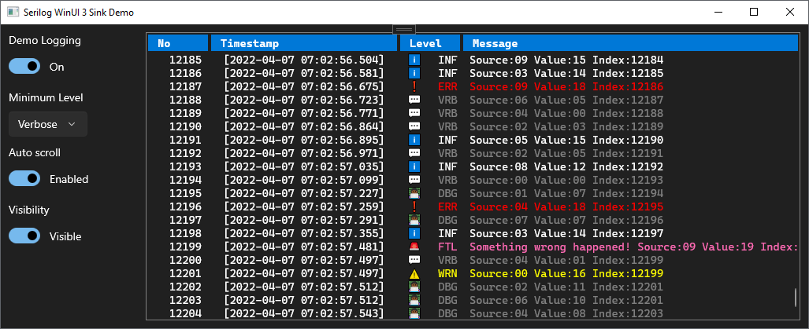

# 📃 Serilog.Sinks.WinUi3
A [Serilog](https://github.com/serilog/serilog) sink that writes log events to WinUI 3 collection controls like [ItemsRepeater](https://docs.microsoft.com/en-us/windows/apps/design/controls/items-repeater).



## 🙌 Quick Start
Install the Serilog.Sinks.WinUi3 package.
```powershell
Install-Package Serilog.Sinks.WinUi3 -Prerelease
```
Install the Serilog.Sinks.WinUi3.LogViewModels package. (Optional: You can implement your own viewmodels for your logs.)
```powershell
Install-Package Serilog.Sinks.WinUi3.LogViewModels -Prerelease
```
Also install these Serilog packages.
```powershell
Install-Package Serilog
Install-Package Serilog.Expressions
```
Like the example below, create a LogBroker (naming is hard...) and a LogViewModelBuilder, register your LogBroker with `WriteTo.WinUi3Control()` and create the logger. Take a look at the sample app.
```csharp
// Create your custom LogBroker.
_logBroker = new ItemsRepeaterLogBroker(
    LogSinkItemsRepeater,
    LogSinkScrollViewer,
    new EmojiLogViewModelBuilder(defaultForeground: Colors.White)
        // Timestamp format
        .SetTimestampFormat(new ExpressionTemplate("[{@t:yyyy-MM-dd HH:mm:ss.fff}]"))
        // Level format and colors
        .SetLevelsFormat(new ExpressionTemplate("{@l:u3}"))
        .SetLevelForeground(LogEventLevel.Verbose, Colors.Gray)
        .SetLevelForeground(LogEventLevel.Debug, Colors.Gray)
        .SetLevelForeground(LogEventLevel.Warning, Colors.Yellow)
        .SetLevelForeground(LogEventLevel.Error, Colors.Red)
        .SetLevelForeground(LogEventLevel.Fatal, Colors.HotPink)
        // Message format and colors
        .SetMessageFormat(new ExpressionTemplate("{@m}"))
        .SetMessageForeground(LogEventLevel.Verbose, Colors.Gray)
        .SetMessageForeground(LogEventLevel.Debug, Colors.Gray)
        .SetMessageForeground(LogEventLevel.Warning, Colors.Yellow)
        .SetMessageForeground(LogEventLevel.Error, Colors.Red)
        .SetMessageForeground(LogEventLevel.Fatal, Colors.HotPink)
        // Exception format and color
        .SetExceptionFormat(new ExpressionTemplate("{@x}"))
        .SetExceptionForeground(Colors.HotPink)
        );

// Register your LogBroker with WriteTo.WinUi3Control() and create the logger.
Log.Logger = new LoggerConfiguration()
    .WriteTo.WinUi3Control(_logBroker)
    .CreateLogger();
```

## ⚠️ Warning
Avoid using the **ItemsRepeater** with variable height items. There is a known [bug](https://github.com/microsoft/microsoft-ui-xaml/issues/1829) on the **ItemsRepeater** and the **Microsoft Team** is still working on it.

## 🎬 YouTube
- [Coding Serilog.Sinks.WinUi3](https://youtu.be/_9lCC7yW5zQ)
- [Implemeting Serilog.Sink.WinUi3 to the PhotoOrganizer](https://youtu.be/P44vT1B9McU)
